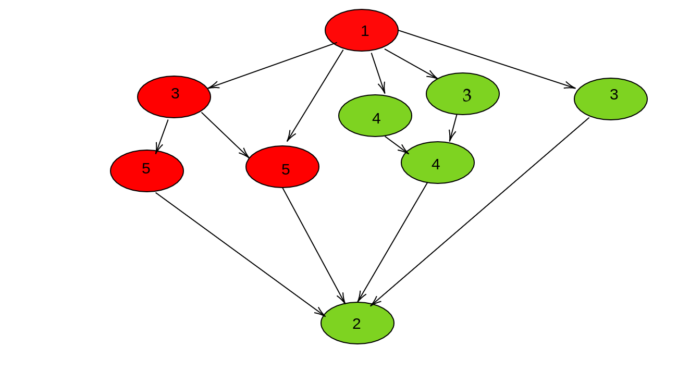

# Autor: Antonio Jesús Heredia Castillo
## Ejercicio 1
El grado medio de concurrencia seria:

\
$M=\frac{\sum_{i=1}^{N} \operatorname{coste}\left(n o d o_{i}\right)}{L}=\frac{1+3+4+3+3+5+5+4+2}{11}=\frac{30}{11}=2.\overline{72}$


\
Una destribucción que se me ocurre podria ser la siguiente:
\

\
Con esta distribución la carga quedaria distribuida en:
\
$P_1=1+3+5+5=14$
\
$P_2=4+3+3+4+2=16$
## Ejercicio 2
### $a_)$
$M=\frac{\sum_{i=1}^{N} \operatorname{coste}\left(n o d o_{i}\right)}{L}=\frac{2+2+2+12+3+3+12+12+12}{19}=\frac{60}{19}=3.1578$

\
El reparto que yo haria de procesos seria el siguiente:
- $P_1 = 4,2,1$
- $P_2 = 8,5$
- $P_3 = 9,6$
- $P_4 = 7,3$
  
| i | 1 | 2 | 3 | 4 | 5 | 6 | 7 | 8 | 9 | 10 | 11 | 12 | 13 | 14 | 15 | 16 | 17 | 18 | 
|--|--|--|--|--|--|--|--|--|--|--|--|--|--|--|--|--|--|--|
| P1 | $t_4$ | $t_4$ | $t_4$ | $t_4$ | $t_4$ | $t_4$ | $t_4$ | $t_4$ | $t_4$ | $t_4$ | $t_4$ | $t_4$ | | | | $t_2$ | $t_2$ | $t_1$ |
| P2 | $t_8$ | $t_8$ | $t_8$ | $t_8$ | $t_8$ | $t_8$ | $t_8$ | $t_8$ | $t_8$ | $t_8$ | $t_8$ | $t_8$ | $t_5$ | $t_5$ | $t_5$ |  | | |
| P3 | $t_9$ | $t_9$ | $t_9$ | $t_9$ | $t_9$ | $t_9$ | $t_9$ | $t_9$ | $t_9$ | $t_9$ | $t_9$ | $t_9$ | $t_6$ | $t_6$ | $t_6$ |
| P4 | $t_7$ | $t_7$ | $t_7$ | $t_7$ | $t_7$ | $t_7$ | $t_7$ | $t_7$ | $t_7$ | $t_7$ | $t_7$ | $t_7$ | | | | $t_3$ | $t_3$ 
### $b_)$

$M=\frac{\sum_{i=1}^{N} \operatorname{coste}\left(n o d o_{i}\right)}{L}=\frac{1+2+1+3+3+4+5+1+4+6+4}{21}=\frac{34}{21}=1.619$

\
El reparto que yo haria de procesos seria el siguiente:
- $P_1 = 1,4,7,10$. El coste seria: 10
- $P_2 = 0,2,5,8$. El coste seria: 10
- $P_3 = 3,6,9$. El coste seria: 14

\
El diagrama de ejecución quedaria tal que asi: 
| i | 1 | 2 | 3 | 4 | 5 | 6 | 7 | 8 | 9 | 10 | 11 | 12 | 13 | 14 | 15 | 16 | 17 | 18 | 
|--|--|--|--|--|--|--|--|--|--|--|--|--|--|--|--|--|--|--|
|$P_1$ | | $T_1$ | $T_1$ | $T_4$ | $T_4$ | $T_4$ | | $T_7$| | | | | | | | | | $T_{10}$|
|$P_2$ | $T_0$ |$T_2$ | |$T_5$ | $T_5$ | $T_5$ | $T_5$ |  $T_8$ |  $T_8$ | $T_8$ | $T_8$ |
|$P_3$ | | $T_3$ | $T_3$ |  $T_3$ |  $T_6$ |  $T_6$ |  $T_6$ |  $T_6$ |  $T_6$ | | | $T_9$ | $T_9$ | $T_9$ | $T_9$ | $T_9$ | $T_9$ |

## Ejercicio 3
#### $a_)$


```
Para k= 0 hasta numero iteraciones hacer
    Envia(Bloque[0], (i - 1) mod p);
    Envia(Bloque[0], (i - 2) mod p);
    Envia(Bloque[n/p - 1], (i + 1) mod p);

    Recibe(izquierda, (i - 1) mod p);
    Recibe(derecha1, (i + 1) mod p);
    Recibe(derecha2, (i + 2) mod p);

    Para j= 0 hasta n/p - 2 hacer
        tmp=Bloque[j];
        Bloque[j]=((izquierda + Bloque[j]) * (Bloque[j + 1] - Bloque[j + 2]) )/8;
        izquierda=tmp;

    Bloque[n/p - 1]=((izquierda + Bloque[n/p - 1]) * (derecha1 - derecha2))/+;
```

\
El diagrama de comunicación sera tal que asi:
\
