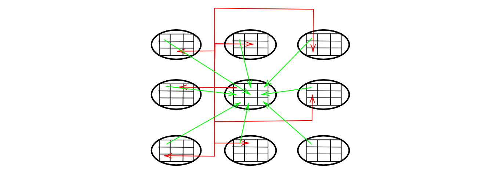
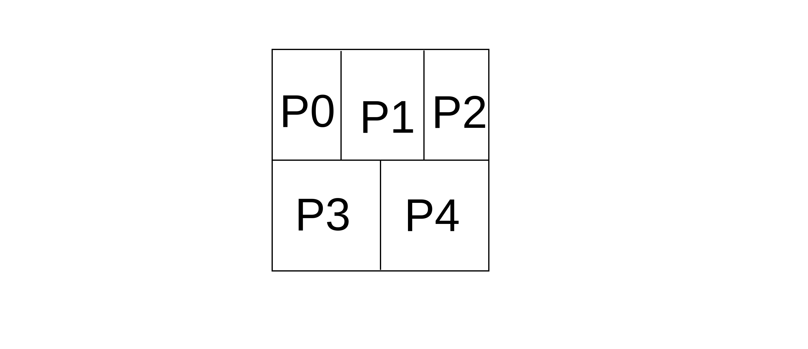
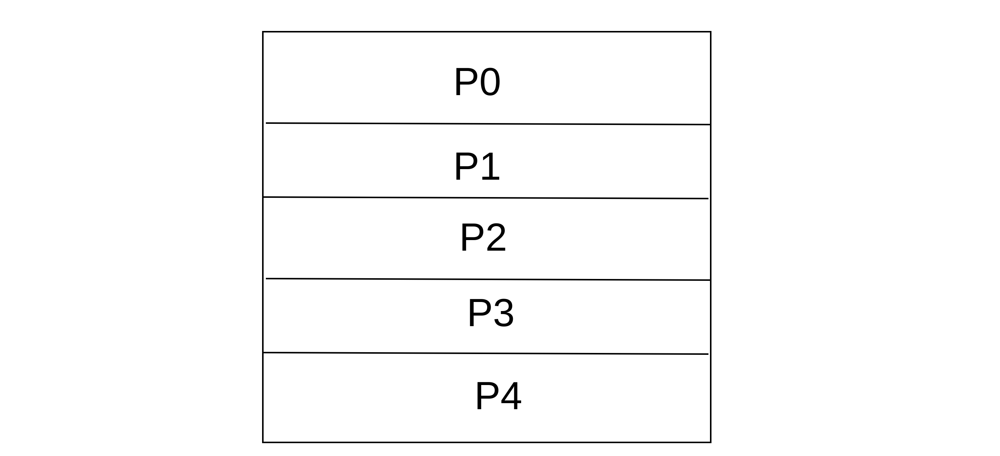
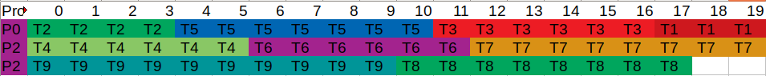
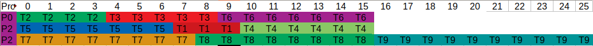

# Autor: Antonio Jesús Heredia Castillo
## Ejercicio 4
###  Se desea paralelizar un programa secuencial que procesa una malla bidimensional $X$ de $1000\times1000$ puntos (una matriz), actualizándola de acuerdo al siguiente esquema iterativo:

$$X_{i, j}^{t+1}=\frac{4 X_{i, j}^{t}+X_{i+1, j+1}^{t}+X_{i+1, j-1}^{t}+X_{i-1, j+1}^{t}+X_{i-1, j-1}^{t}}{20}$$

### Además, en cada iteración se calcula el máximo de los puntos situados en cada diagonal de la malla para chequear convergencia. Inicialmente, el problema se descompone en una tarea por punto de la malla.
***

La iteración i-ésima seria se calcularía de la siguiente forma:
```
valores[9];
valores[0] = inicializar();
Para k= 0 hasta numero iteraciones hacer
    //Envio a las verticales y horizontales primero
    Envia(valores[0], (i - 1) mod p, j mod p);
    Envia(valores[0],  i mod p, (j -1) mod p);
    Envia(valores[0], (i + 1) mod p, (j -1) mod p);
    Envia(valores[0],  i mod p, (j + 1) mod p);
    //Envio a las diagonales
    Envia(valores[0], (i - 1) mod p, (j - 1) mod p);
    Envia(valores[0], (i - 1) mod p, (j + 1) mod p);
    Envia(valores[0], (i + 1) mod p, (j - 1) mod p);
    Envia(valores[0], (i + 1) mod p, (j + 1) mod p);

    //Recibo de las verticales y horizontales
    Recibe(valores[1], (i - 1) mod p, j mod p);
    Recibe(valores[2],  i mod p, (j -1) mod p);
    Recibe(valores[3], (i + 1) mod p, j mod p);
    Recibe(valores[4],  i mod p, (j + 1) mod p);

    //Recibo a las diagonales
    Recibe(valores[5], (i - 1) mod p, (j - 1) mod p);
    Recibe(valores[6], (i - 1) mod p, (j + 1) mod p);
    Recibe(valores[7], (i + 1) mod p, (j - 1) mod p);
    Recibe(valores[8], (i + 1) mod p, (j + 1) mod p);

    
    // Por simplicidad el resultado se guarda en el vector de 
    // entrada para la siguiente iteración
    Bloque[0]= (4*valores[0]+valores[1]+valores[2]+valores[3]+valores[4])/20;
   
   //Calculo el maximo
    maximo = -infinito
    Para h=5 hasta h=8;
        Si valores[h] > maximo:
            maximo = valores[h]
```

Un esbozo de la estructura de comunicación seria (por limpieza con las flechas, puede no coincidir la posición de la flecha, con la posición en la matriz del pseudocódigo):



Las flechas verdes son las que se reciben y las flechas rojas las que se envian.

### Establecer una estrategia de asignación adecuadas para resolver el problema sobre 5 procesadores, justificando las decisiones tomadas.
***

Para $P=5$ una asignación eficiente podría ser asignar a cada procesador un bloque bidimensional  de tamaño $(\lceil\frac{1000}{\sqrt{5}}\rceil,\lceil\frac{1000}{\sqrt{5}}\rceil)$ elementos contiguos, que seria el tamaño optimo. Pero esta distribución es imposible. 

Una alternativa podría ser dividir la cantidad de filas entre 2, quedando dos partes iguales. Luego la primera mitad, la dividimos en tres partes iguales (aunque habrá una que tenga una fila más) y se la asignamos a $P0,P1,P2$, con la segunda mitad horizontal podemos dividirla en dos partes iguales y asignársela a $P3$ y $P4$. He elegido esta posibilidad ya que creo que es la forma de que tenga que pedir menos datos. Quedando algo asi:




Otra posibilidad seria dividir la matriz en cinco partes con el mismo numero de elementos, pero con un mayor numero de columnas que de filas por cada procesador, teniendo asi un mayor grado de paralización.

 

## Ejercicio 7
###  Disponemos de __9__ tareas, __T1, T2, ..., T9__ que deben ser ejecutadas sobre __3__ procesadores idénticos __(P0, P1 y P2)__. Los tiempos de ejecución de cada tarea vienen dados en la siguiente tabla:


|Tarea| T1 | T2 | T3 | T4 | T5 | T6 | T7 | T8 | T9 |
|--| -- | -- | -- | -- | -- | -- | -- | -- | -- |
|Coste| 3 | 4 | 5 | 6 | 7 | 7 | 8 | 8 | 9 |

#### Se ha diseñado un algoritmo paralelo que utiliza un esquema de asignación dinámica centralizada tipo maestro-esclavo para planificar la ejecución de las tareas en los tres procesadores, donde el maestro va asignando una tarea a cada procesador como respuesta a la petición de otro procesador.
#### En este algoritmo, el procesador P0 es el maestro, pero también hace el papel de esclavo en el sentido de que también ejecuta tareas. También se supone que el coste de seleccionar y encargar la realización de una tarea a un procesador (ya sea P0 mismo, P1 ó P2) no conlleva ningún coste en P0 y que la selección de la siguiente tarea a asignar a un procesador que demanda trabajo se hace de forma aleatoria.
#### Calcular la ganacia en velocidad (speedup) que se obtendría en el peor caso y en el mejor caso bajo estas suposiciones. Mostrar uno de los mejores casos y uno de los peores casos indicando qué tareas ejecutaría cada proceso y en qué orden.

***
Si se ejecutara de forma lineal tardaria $57$ ticks de tiempo.

El mejor caso podría ser:



Por lo tanto la ganancia de velocidad seria: $\frac{57}{20}=2.85$

El mejor caso que he conseguido encontrar es:



Por lo tanto la ganancia de velocidad seria: $\frac{57}{26}=2.19$


## Ejercicio 9
