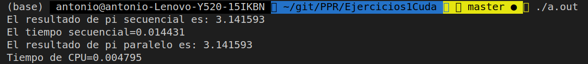

# Autor: Antonio Jesús Heredia Castillo
## Ejercicio 8
#### Observa que en el kernel de reducción que se presenta a continuación, para sumar N valores de un vector de números reales, la mitad de las hebras de cada bloque no hacen ningún trabajo después de participar en la carga de datos desde memoria global a un vector en memoria compartida (sdata). Modifica este kernel para eliminar esta ineficiencia y da los valores de los parámetros de configuración que permiten usar el kernel modificado para sumar N reales. ¿Habría algún costo extra en término de operaciones aritméticas necesitadas? ¿Tendría alguna limitación esta solución en términos de uso de recursos?
El codigo original es el siguiente:
```c
__global__ void reduceSum(float *d_V,int N){
    extern __shared__ float sdata[];
    int tid = threadIdx.x;
    int i = blockIdx.x*blockDim.x + threadIdx.x;
    sdata[tid] = ((i < N) ? d_V[i] : 0.0f);
    __syncthreads();

    for (int s=blockDim.x/2; s>0; s>>=1) {
        if (tid < s) {
            sdata[tid] += sdata[tid + s];
        }
        __syncthreads();
    }
    if (tid == 0) d_V[blockIdx.x] = sdata[0];
}
```

La modificación que propongo es la siguiente:
```c
__global__ void
reduceSum(float *d_V,int N)
{
    extern __shared__ float sdata[];

    int tid = threadIdx.x;
    int i = blockIdx.x*blockDim.x*2 + threadIdx.x;
    float suma = (i<n) ? d_V[i] : 0
    if ( i+blockDim.x < n)
        suma += d_V[i+blockDim.x]
    sdata[tid] = mySum;
    __syncthreads();

     for (int s=blockDim.x/2; s>0; s>>=1) {
        if (tid < s) {
            sdata[tid] = suma += sdata[tid + s];
        }
        __syncthreads();
    }
    if (tid == 0) d_V[blockIdx.x] = suma;
}
```

Con la modificación anterior lo que estamos realizando es una cosa muy simple. Ahorrar la mitad de las hebras. Ya que con $\frac{N}{2}$ somos capaces de traspasar todas los datos de _d_v_ a memoria compartida. Ademas de traspasar los datos también realizamos la reducción a la mitad de N. Es decir realizamos la primera suma de los elementos que en el código anterior se realizaría en la primera interacción del for. 

Los parámetros que usaría para invocar este kernel seria:
```c
cantidad_bloques = cantidad_bloques_anterior
cantidad_hebras_por_bloque = cantidad_hebras_por_bloque_anterior/2
```
No habrá un coste superior en operaciones aritméticas ya que la cantidad de sumas que se realiza es la misma. Como la cantidad de operaciones usadas es la misma y la memoria también es la misma, no creo que haya ninguna limitación en los recursos.
## Ejercicio 10
#### Implementar un kernel para aproximar el valor de pi tal como se hace en este código secuencial:
```c
static long num_steps = 100000;
double step;
void main () {
    int i; double x, pi, sum = 0.0;
    step = 1.0/(double) num_steps;
    for (i=1;i<= num_steps; i++){
        x = (i-0.5)*step;
        sum = sum + 4.0/(1.0+x*x);
    }
    pi = step * sum;
```
El código completo podemos encontrarlo adjunto con este documento. Por evitar poner todo los datos simplemente pondré aquí el kernel cuda que se encarga de realizar el código anterior excepto la suma.
```c
__global__ void calcularPI(double *A, double step, int N )
{
  int i = blockIdx.x * blockDim.x + threadIdx.x; // Compute row index
  if (i < N)
  {
    double x = (i + 1 - 0.5) * step;
    A[i] = 4.0 / (1.0 + x * x);
  }
}
```
Guardo los datos calculados por cada hebra en un vector y luego lo sumare con una función de reducción. 
Un ejemplo del resultado de la ejecución del código creado es el siguiente:

