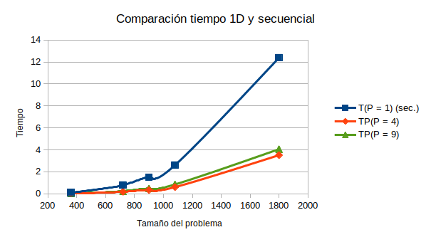
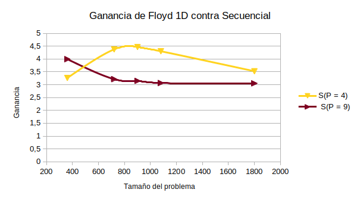
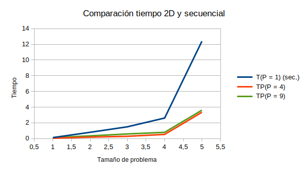
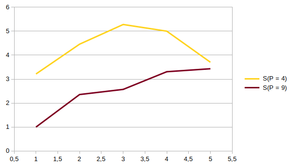
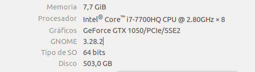

# Practica 2
## Implementación en memoria distribuida de un algoritmo paralelo de datos
### Autor: Antonio Jesús Heredia Castillo
Lo unico que cambia en la memoria es la recolección de los tiempos y la gráfica, ya que las conclusiones que extraigo son las mismas.

#### Realizar medidas de tiempo de ejecución sobre los algoritmos disponibles. Deberán realizarse las siguientes medidas
En la siguiente tabla podemos ver tanto los tiempos obtenidos para la ejucución del algoritmo secuencial y el algoritmo paralelo **1D para 4 y 9 procesos** respectivamente. También hemos calculado la ganancia de velocidad de los algoritmos paralelos frente a los secuenciales. 

|          | T(P = 1) (sec.) | TP(P = 4) | S(P = 4) | TP(P = 9) | S(P = 9) |
| -------- | --------------- | --------- | -------- | --------- | -------- |
| N = 360  | 0.116928        | 0.0358327 | 3,26316  | 0.0292657 | 3,995393 |
| N = 720  | 0.79253         | 0.181118  | 4,37576  | 0.246395  | 3,216501 |
| N = 900  | 1.4924          | 0.334012  | 4,46810  | 0.474063  | 3,148104 |
| N = 1080 | 2.60886         | 0.606349  | 4,30257  | 0.850526  | 3,06734  |
| N = 1800 | 12.3818         | 3.51251   | 3,52505  | 4.05643   | 3,05238  |

Para ver como aumenta el tiempo según el tamaño del problema podemos ver la siguiente imagen:
\

Como podemos ver si lo ejecutamos de forma secuencia **el tiempo aumenta muy rápidamente**, mientras que en los algoritmos paralelos el tiempo no se dispara tanto. También podemos ver como el usar mas procesos, no significa que vaya a funcionar mas rápido, de hecho podemos ver como cuanto mayor es el tamaño del problema mejor va usando cuatro procesadores. Esto lo podemos ver mejor en la siguiente gráfica, en el de ganancia de velocidad.
\

Algo que nos indica la gráfica, es que posiblemente para tamaño de problema aun mas grande, si que podríamos obtener mejores tiempo con mas procesos, pero para problemas pequeños, hay demasiada carga de comunicación. 

Usando el algoritmo de **Floyd 2D** he obtenido los siguiente resultados:

|          | T(P = 1) (sec.) | TP(P = 4) | S(P = 4) | TP(P = 9) | S(P = 9) |
| -------- | --------------- | --------- | -------- | --------- | -------- |
| N = 360  | 0.116928        | 0.0363799 | 3,21408  | 0.117072  | 0,99876  |
| N = 720  | 0.79253         | 0.177794  | 4,45757  | 0.336393  | 2,35596  |
| N = 900  | 1.4924          | 0.282714  | 5,27883  | 0.58049   | 2,57093  |
| N = 1080 | 2.60886         | 0.52183   | 4,99944  | 0.78838   | 3,51145  |
| N = 1800 | 12.3818         | 3.34184   | 3,70508  | 3.60654   | 3,43315  |

Al igual que antes, he realizado unas gráficas para entender mejor los resultados. En el caso del algoritmo 2D, vuelve a pasar lo mismo. Con menos procesos, el tiempo es menor, algo que a priori podría parecer contra intuitivo, pero si analizamos que mas proceso implica mas comunicaciones, puede tener sentido.
\

En la gráfica de ganancia, vuelve a pasar lo mismo que antes, aunque para tamaños de problema pequeños sin duda es mejor tener menos procesos, la curva nos indica que llegado un tamaño de problema lo suficiente grande, tener 9 procesos acabara siendo mejor que 4.
\

Las características del PC son:
\

