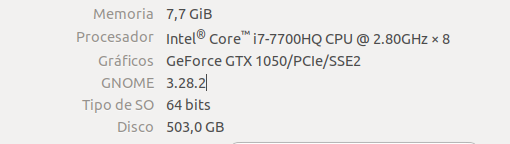

# Practica 3
## Implementación distribuida de un algoritmo de equilibrado dinámico de la carga usando MPI

___

## Autor: Antonio Jesús Heredia Castillo
Para comprobar hemos realizado varios experimentos para ver como afectan los distintos parámetros a el tiempo y por lo tanto que ganancia de velocidad podemos obtener.

### Secuencial

La primera toma de datos que realizamos es la de la ejecución secuencial. Como era de esperar el tiempo, al igual que las iteraciones, aumenta conforme el numero de ciudades aumenta. 

| Nº Ciudadades| 10 | 20 | 30 | 35 | 40 |
| -- | -- | -- | -- | -- | -- |
|Tiempo | 0.000820958 | 0.0621048 | 0.176419 | 2.00586 | 5.61145 |
|Iteraciones | 207 | 3755 | 6957 | 71107 | 158556 |

### Incluyendo difusión de cota superior
#### Con 2 procesadores
La siguiente tabla nos muestra el tiempo recogido cuando ejecutamos con 2 procesadores y ademas difundimos la cota superior. 

| Nº Ciudadades| 10 | 20 | 30 | 35 | 40 |
| -- | -- | -- | -- | -- | -- |
|Tiempo | 0.00219474 | 0.033326 | 0.0922969 | 0.844801 | 3.17334 |
| Ganancia | 0,37405706 |1,863553 | 1,9114293 | 2,374357 | 1,76831 |
|Iteraciones P1 | 100 | 1576 | 3643 | 26097 | 83363 |
|Iteraciones P2 | 116 | 1584 | 3594 | 26054 | 82824 |

Podemos ver como el tiempo, como era de esperar disminuye. Ademas tenemos que, como se esperaba, la ganancia se duplica o en algún caso es mayor que el doble. Cumpliendo asi una de las indicaciones de chequeo de la calidad de la solución paralela. 

#### Con 3 procesadores

| Nº Ciudadades| 10 | 20 | 30 | 35 | 40 |
| -- | -- | -- | -- | -- | -- |
|Tiempo | 0.00200785 | 0.0357896 | 0.0859988 | 0.509098 | 1.26461 |
|Ganancia | 0,40887416| 1,7352750| 2,0514123 | 3,940027 | 4,43729 |
|Iteraciones P1 | 79 | 1259 | 2307 | 16438 | 34804 |
|Iteraciones P2 | 84 | 1285 | 2333 | 15589 | 34355 |
|Iteraciones P3 | 78 | 912 | 3159 | 15633 | 34753 |

Lo mismo pasa con 3 procesadores, la ganancia llega a ser incluso 4 veces mayor. 
Otra cosa interesante que podemos ver es como la suma de las iteraciones da "algo cercado" a lo mismo que nos da la ejecución secuencial. 

### Sin difusión de cota superior

En este apartado vamos a ver los datos obtenidos de la ejecución con 2 y 3 procesadores pero sin difundir la cota superior. Como los datos obtenidos en los dos experimentos son parecidos voy a explicar como introducción los rasgos importantes. 

Una cosa que podemos observar si no difundimos la cota es que la ganancia que conseguimos no varia usando mas procesadores. Aunque esto habría que comprobarlo usando tamaños de problema mas grande.

Otra cosa que podemos ver es como el numero de iteraciones aumenta. Esto pasa claramente porque como no se intercambian las cotas necesitan explorar mas nodos cada uno. 

#### Con 2 procesadores

| Nº Ciudadades| 10 | 20 | 30 | 35 | 40 |
| -- | -- | -- | -- | -- | -- |
|Tiempo | 0.00219474 | 0.0422067 | 0.115515 | 0.969387 | 1.83036 |
| Ganancia | 0,37405706 | 1,4714441 | 1,527238 | 2,069204 | 3,06576 |
|Iteraciones P1 | 105 | 2515 | 5517 | 37973 | 57261 |
|Iteraciones P2 | 133 | 2664 | 5520 | 38501 | 58890 |

#### Con 3 procesadores

| Nº Ciudadades| 10 | 20 | 30 | 35 | 40 |
| -- | -- | -- | -- | -- | -- |
| Tiempo | 0.0032869 | 0.0381757 | 0.1058 | 0.804832 | 1.8851 |
| Ganancia | 0,2497666 | 1,6268149 | 1,6674 | 2,492271 | 2,9767386|
|Iteraciones P1 | 138 | 2541 | 5498 | 32506 | 59174 |
|Iteraciones P2 | 94 | 1731 | 5242 | 32221 | 58004 |
|Iteraciones P3 | 104 | 1594 | 5712 | 31947 | 60194 |

### Gráficas Comparativas
Los datos mencionados anterior mente los podemos observar mejor en las siguientes gráficas.

Como era de esperar en la ejecución secuencial podemos ver como la curva se asemeja a un crecimiento exponencial. Lo cual concuerda con lo que "teoricamente" se debería obtener. El tiempo que sin duda tiene un menor crecimiento es usando tres procesadores e intercambiando cotas. 

En la siguiente gráfica podemos observar como se comporta la ganancia.  Como era de esperar la mejor ganancia ha sido la de con tres procesadores e intercambio de cota. Pero un comportamiento interesante que podemos ver es como con dos procesadores e intercambio de cota, la ganancia se queda entorno al 2 sin grandes variaciones, lo cual nos indica que estamos teniendo la ganancia teoría que esperábamos. 

### Plataforma usada

 

 