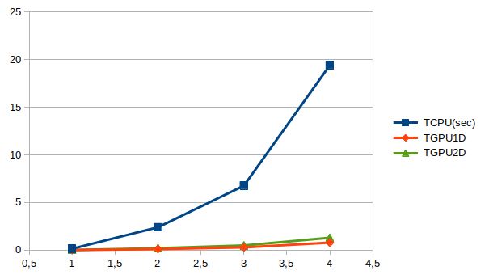
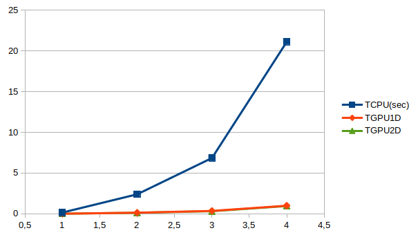
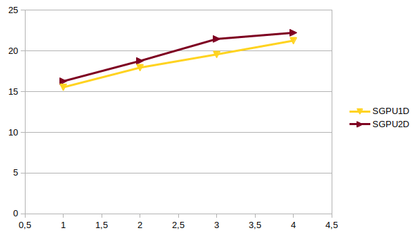
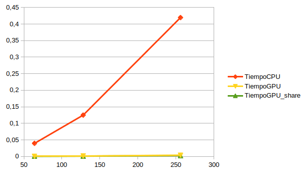

# Practica 1
## Autor: Antonio Jesús Heredia Castillo

### 1.1 Implementación en CUDA del Algoritmo de Floyd
#### Modificar la implementación CUDA del algoritmo de Floyd para que las hebras CUDA se organicen como una grid bidimensional de bloques cuadrados de hebras bidimensionales. Los ejemplos de tamaños de bloque usuales son: 8 × 8, 16 × 16 y 32 × 32. Realizar también medidas de tiempo de ejecución sobre los algoritmos implementados. El programa plantilla que se ofrece incluye la toma de los tiempos de ejecución del algoritmo en CPU y en GPU. Deberán realizarse las siguientes medidas para problemas de diferentes tamaño y diferentes tamaño de bloque CUDA.
Los tiempos recogidos los podemos ver en las siguientes tablas.

Para un tamaño de bloque de 64 tenemos los siguientes resultados:
| Bsize=8x8 | TCPU(sec) | TGPU1D | SGPU1D  | TGPU2D | SGPU2D |
| -- | -- | -- | -- | -- | -- |
| N = 400 | 0.147095 | 0.00852203 | 17.2605 | 0.0152669 | 9.6349 |
| N = 1000 | 2.40319 | 0.111036 | 21.6434 | 0.203738 | 11.7955 |
| N = 1400 | 6.76661 | 0.287396 | 23.5446 |0.493238 | 13.7188 |
| N = 2000 | 19.4082 | 0.786082 | 24.6898 | 1.30209 | 14.9054 |
La evolución del tiempo para este tamaño de bloque lo podemos ver en la siguiente imagen.

La evolución de la ganancia para este tamaño de bloque lo podemos ver en la siguiente imagen.
 
Como podemos ver en las dos graficas para tamaño de bloque pequeño se comporta mejor el 1D ya que accede a los datos que se encuentran coalescentes. 
Para un tamaño de bloque de 256 tenemos los siguientes resultados:
| Bsize=16x16 | TCPU(sec) | TGPU1D | SGPU1D  | TGPU2D | SGPU2D |
| -- | -- | -- | -- | -- | -- |
| N = 400 | 0.148627 | 0.010216 | 14.5485 | 0.00805593 | 18.4494 |
| N = 1000 | 2.39243 | 0.109074 | 21.934 | 0.132783 | 18.0176 |
| N = 1400 | 6.65443 | 0.284877 | 23.359 |0.308713 | 21.5554 |
| N = 2000 | 19.5901 | 0.780479 | 25.1001 | 0.738071 | 26.5423 |
La evolución del tiempo para este tamaño de bloque lo podemos ver en la siguiente imagen.

La evolución de la ganancia para este tamaño de bloque lo podemos ver en la siguiente imagen.
 
Para este tamaño parece que vamos a tener tiempos muy parecidos y que va a depender mucho de la ejecución, en momentos ira mejor uno o mejor otro.
Para un tamaño de bloque de 1024 tenemos los siguientes resultados:
| Bsize=32x32 | TCPU(sec) | TGPU1D | SGPU1D  | TGPU2D | SGPU2D |
| -- | -- | -- | -- | -- | -- |
| N = 400 | 0.149473 | 0.00962305 | 15.5328 | 0.00918221 | 16.2785 |
| N = 1000 | 2.39023 | 0.133178 | 17.9476 | 0.127342 | 18.7701 |
| N = 1400 | 6.84747 | 0.349895 | 19.5701 |0.318963 | 21.4679 |
| N = 2000 | 21.1224 |  0.993433 | 21.2621 | 0.950201 | 22.2294 |

La evolución del tiempo para este tamaño de bloque lo podemos ver en la siguiente imagen.

La evolución de la ganancia para este tamaño de bloque lo podemos ver en la siguiente imagen.
 
En este caso como podemos ver en la ganancia, funciona algo mejor usar bloques 2D.
#### Extender la implementación en CUDA C desarrollada para que se calcule también la longitud del camino de mayor longitud dentro de los caminos más cortos encontrados. Usar para ello un kernel CUDA de reducción aplicado al vector que almacena los valores de la matriz resultado. Se pueden usar los kernels de reducción disponibles en las CUDA Samples.

Una vez implementado los resultados son:
|Tamaño del problema|Longitud del camino|
| -- | -- |
| N = 400 | 635 |
| N = 1000 | 1444 |
| N = 1400 | 2008 |
| N = 2000 | 2811 |

### 1.2 Implementación CUDA de una operación vectorial
#### Se deberán realizar dos implementaciones CUDA C: una que realiza el cálculo del vector C (primera fase de cálculo) utilizando variables en memoria compartida y otra que no utilice este tipo de almacenamiento para esta fase de cálculo. Para el resto de fases se recomienda usar memoria compartida.
Realizado. Se puede ver en el codigo adjunto.

#### Se deberán comparar los resultados obtenidos, tanto en tiempo de ejecución como en la exectitud de los valores obtenidos con respecto a las salidas del código CPU. Para ello, se utilizarán valores altos para N (N > 20000), probando los tres tamaños de bloque indicados al inicio de este ejercicio y las versiones con y sin memoria compartida para el cálculo del vector C.
Primero tomamos lso datos usando memoria compartida.
| k | M |  N | Tiempo CPU | Tiempo GPU | Tiempo GPU_share |
| -- | -- | -- | -- | -- | -- |
| 2000 | 64 | 128000 | 0.039544 | 0.000525 | 0.000418 |
| 2000 | 128 | 256000 | 0.124847 | 0.001328 | 0.001004 |
| 2000 | 256 | 512000 | 0.419498 | 0.003863 | 0.002764 |
En la siguiente imagen podemos ver la comparación entre la ejecución en CPU, GPU y GPU usando memoria compartida.

Como podemos ver donde mas se tarda claramente es en CPU como era de esperar. Para ver como es la diferencia entre usar memoria compartida y no usarla tenemos la siguiente imagen.

Como podemos observar al principio no hay mucha diferencia pero conforme el tamaño del problema aumenta la diferencia va siendo mas grande.